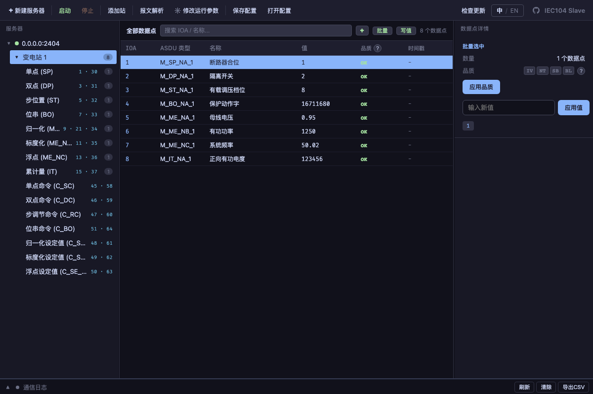
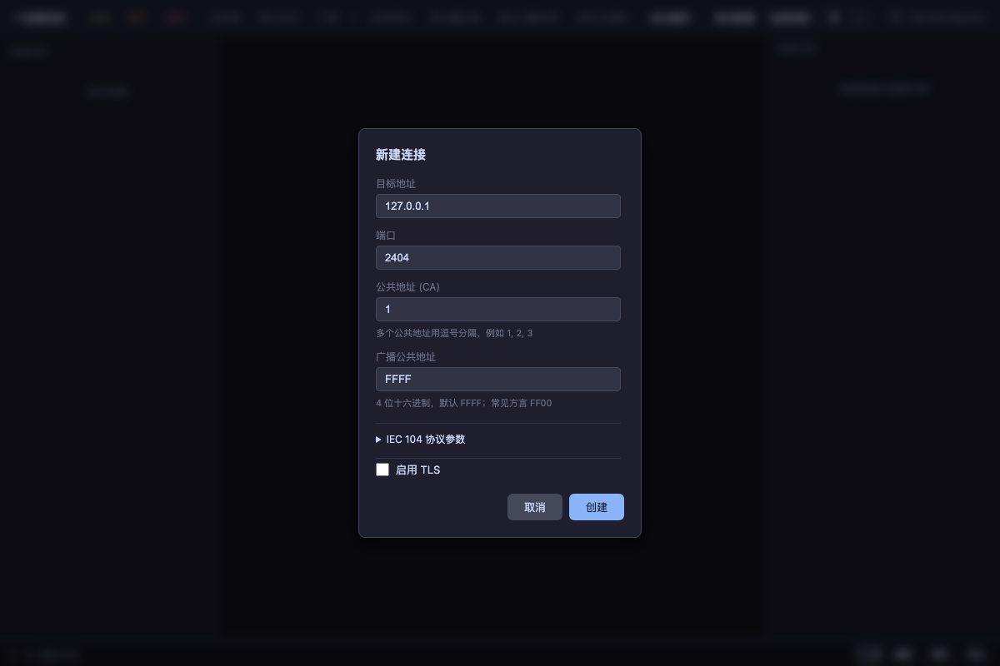
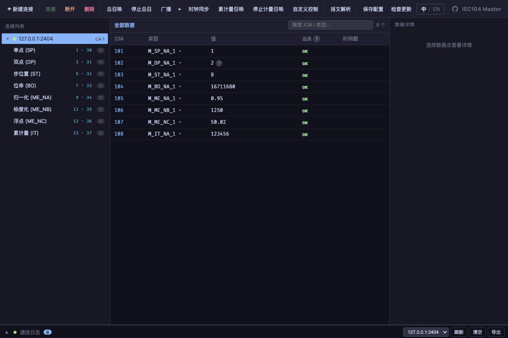
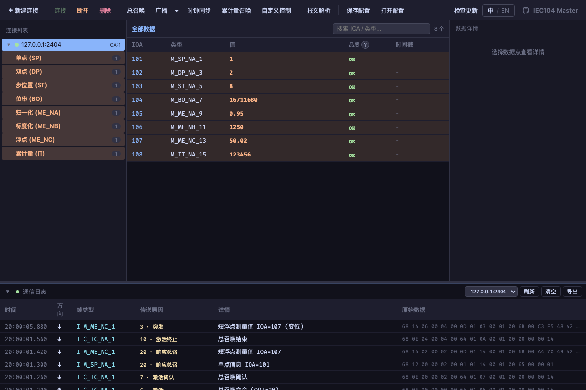

<div align="center">

# ⚡ IEC 60870-5-104 Simulator

**A cross-platform IEC 60870-5-104 protocol simulator — Slave _and_ Master, in one desktop toolkit.**

[](https://github.com/Karl-Dai/IEC60870-5-104-Simulator/releases)
[](https://github.com/Karl-Dai/IEC60870-5-104-Simulator/releases)
[](https://github.com/Karl-Dai/IEC60870-5-104-Simulator/stargazers)
[](LICENSE)
[]()

Built with **Rust** · **Tauri 2** · **Vue 3**

**English** · [中文](README_CN.md)


</div>

---

## Why this project

Testing an IEC 104 integration usually means borrowing a real RTU or a master station. This project puts **both ends on your desktop**:

- 🛰️ **Slave & Master in one repo** — simulate a substation device, or drive one, with no external hardware.
- 🔌 **Full protocol coverage** — 8 monitored data types, every control command, GI / Counter / Clock-Sync, over **TCP or mutual TLS**.
- 🌐 **Multi-CA on a single link** — one TCP connection talks to many Common Addresses at once, each kept separate.
- 🖥️ **Native desktop app** — small Rust + Tauri binaries for Windows, macOS and Linux, with in-app auto-update.
- 🌏 **Bilingual UI** — full English / 简体中文, switchable at runtime.

## Table of Contents

- [Screenshots](#screenshots)
- [Features](#features)
- [Download](#download)
- [Build from Source](#build-from-source)
- [Quick Start (Tutorial)](#quick-start-tutorial)
- [Protocol Support](#protocol-support)
- [Architecture](#architecture)
- [Contributing](#contributing)
- [Changelog](#changelog)
- [macOS First Launch](#macos-first-launch)
- [License](#license)

## Screenshots

**Master · multi-CA on one TCP link**

One IEC 104 master connection can talk to several stations (Common Addresses) at once. Configure the CA list as `1, 2, 3` in the **New Connection** dialog and the connection tree expands to **Connection → CA badge → category**, with per-CA point counts — so two stations sharing the same IOA never collide on screen.


**Master · communication log with TLS handshake & per-CA GI**

The bottom log panel shows every TLS handshake step, U/I/S frame, COT decode, and the raw hex bytes side-by-side. Here the master sends **GI CA=1** and **GI CA=2** in sequence and receives the spontaneous response stream from each station.


## Features

### 🛰️ Slave — `IEC104Slave`

- **IEC 104 server** with TCP and TLS support
- **8 data types** — Single Point, Double Point, Step Position, Bitstring, Normalized, Scaled, Short Float, Integrated Totals
- **Data point management** — add single or batch points with IOA range and ASDU type selection
- **Batch value write by IOA expression** — type a mix of single IOAs and ranges (e.g. `100, 1000-2000, 5000`), pick a type, and write one value to every matching point — with a live matched/ignored preview, no Ctrl-clicking across thousands of rows
- **Per-point periodic mutation** — right-click any point(s) to start/stop a periodic change with an in-row pulse indicator; analog points and counters ramp as a triangle wave (increment/decrement with step and bounds), discrete points flip; points mutate concurrently and independently
- **Random mutation** and **cyclic transmission** — simulate value changes / periodic sending at a configurable interval
- **Spontaneous transmission** (COT=3) — automatically pushes changed values to connected masters
- **General Interrogation** (GI) and **Counter Interrogation** responses
- **Control command handling** — Single, Double, Step and Setpoint commands
- **Editable listen address/port** — change a stopped server's bind address/port in place, no delete-and-recreate
- **Communication log** with hex frame display, drag-to-resize panel and CSV export
- Server auto-starts on creation

### 📡 Master — `IEC104Master`

- **IEC 104 client** with TCP and TLS support
- **Multi-CA per connection** — drive 1..N Common Addresses over a single TCP link. Auto-GI / Clock-Sync / Counter-Read fan out to every CA; data is stored per-CA so colliding IOAs from different stations stay separate
- **Three-level connection tree** for multi-CA setups (Connection → CA badge → category) with independent per-CA counts; single-CA connections keep the classic flat tree
- **Real-time data display** with incremental polling and virtual scrolling
- **Category tree** with live point counts (SP, DP, ST, BO, ME_NA, ME_NB, ME_NC, IT)
- **Custom Control dialog** — pick a CA from the connection's configured list, type any IOA + value; stays open after a successful send for fast iteration and remembers your last CA / IOA / type / value via localStorage
- **Control commands** — Direct Execute and Select-before-Operate (SbO); a right-click on any point routes to its actual source CA in multi-CA setups
- **Value panel** showing selected point details
- **General Interrogation**, **Counter Interrogation** and **Clock Sync** commands — GI and Counter Interrogation are per-CA selectable on multi-CA connections (pick one CA or "all CAs")
- **Deactivation (COT=8)** — stop an in-progress General or Counter Interrogation (per-CA, "all CAs" fan-out, or broadcast); the slave answers with a Deactivation Confirmation (COT=9)
- **Auto-reconnect** — re-establishes a dropped link automatically at the T0 interval
- **Communication log** with TLS handshake events, U/I/S frame decode, COT names, raw hex bytes and CSV export
- **In-app auto-update** from GitHub Releases (ed25519-signed bundles, 6 h check throttle, "later" snoozes 24 h)

## Download

Pre-built installers for every platform are on the **[Releases page](https://github.com/Karl-Dai/IEC60870-5-104-Simulator/releases)**.

| Platform | Installer |
|----------|-----------|
| Windows  | `.msi` / `.exe` (NSIS) |
| macOS    | `.dmg` (Apple Silicon & Intel) |
| Linux    | `.AppImage` / `.deb` |

Both apps **auto-update** from GitHub Releases since v1.0.9. macOS users need [one extra step on first launch](#macos-first-launch).

### China mirror

Users in mainland China may have unstable access to GitHub Releases. Recommended mirror for direct installer downloads:

- <https://ghfast.top/https://github.com/Karl-Dai/IEC60870-5-104-Simulator/releases/latest>

Since v1.12.10 the in-app updater tries a **self-hosted mainland accelerator** (`gh.carldai.cloud`, a Tencent Cloud node that relays through a Singapore reverse proxy to GitHub and mirrors installer downloads via the mainland front) **first**, then falls back to the GitHub origin automatically — no manual action needed. However, **the very first upgrade from an older version** uses the endpoint compiled into the old binary (github.com only); if the in-app update check fails, please download and install the new version once via the mirror above, after which the updater routes through the self-hosted mirror automatically.

## Build from Source

### Prerequisites

- [Rust](https://rustup.rs/) 1.77+
- [Node.js](https://nodejs.org/) 18+
- [Tauri CLI](https://tauri.app/) — `cargo install tauri-cli`

### Steps

```bash
# install frontend dependencies
cd frontend && npm install
cd ../master-frontend && npm install

# run the Slave
cd crates/iec104sim-app && cargo tauri dev

# run the Master
cd crates/iec104master-app && cargo tauri dev
```

## Quick Start (Tutorial)

A full round-trip with the Master driving the simulated Slave — no hardware required. (The screenshots show the Chinese UI; flip to English any time with the **中 / EN** toggle.)

> **Install first:** grab the installer for your platform from the [Releases page](#download), or run from source (`cargo tauri dev`). Open **both** `IEC104Slave` and `IEC104Master`.

### Step 1 · Slave — create a server and add data points

Open **IEC104Slave** and click **新建服务器 (New Server)**: it binds `0.0.0.0:2404` and auto-starts. Add a station, then batch-add points spanning all 8 monitored types — single/double point, step position, bitstring, normalized, scaled, short-float and integrated totals. Each point carries an IOA, a value and quality flags.



**Tip · batch-add**: the **批量添加 (Batch Add)** dialog takes an IOA range (e.g. `1-200`) and an ASDU type, creating hundreds of points in one shot.

### Step 2 · Master — create a connection

Open **IEC104Master** and click **新建连接 (New Connection)**. The defaults already target the local Slave: address `127.0.0.1`, port `2404`, Common Address `1`.

- **Multi-CA on one link** — to reach several stations over a single TCP connection, list the Common Addresses comma-separated (`1, 2, 3`). The connection tree later expands to **Connection → CA badge → category**, with per-CA point counts so colliding IOAs from different stations never mix.
- **TLS** — tick **启用 TLS (Enable TLS)** and provide CA / client cert / key paths to use mutual TLS (Pasted paths with wrapping quotes from Windows *Copy as path* are auto-stripped).

Click **创建 (Create)**, then **连接 (Connect)**.



### Step 3 · General Interrogation fills the table

Press **总召唤 (General Interrogation)**. On a multi-CA connection a menu lets you pick a specific CA or **全部 CA (all CAs)**; single-CA connections send directly. The Slave answers with every point; the connection tree shows per-category counts and the table fills with the received IOAs, values and quality. Normalized measurements show as the raw NVA integer (i16), matching the wire bytes exactly.



**Counter Interrogation** (累计量召唤) and **Clock Sync** (时钟同步) live next to GI — counter interrogation is likewise per-CA selectable on multi-CA links.

### Step 4 · Control a point from the Master

Open **控制 (Control)** (or right-click a data point → **控制** — this routes to the point's actual source CA, so multi-CA setups never send to the wrong station). The **Custom Control dialog** lets you:

- pick a **CA** from the connection's configured list,
- type any **IOA** and value,
- choose a **command type** (single / double / step / setpoint / bitstring),
- choose a **control mode** — **Direct Execute**, **Select-only**, or **Auto SbO** (select-before-operate, persisted for next time).

The dialog stays open after a successful send for fast iteration, and remembers your last CA / IOA / type / value / mode across opens and restarts.

### Step 5 · Mutate values and watch spontaneous updates

Back on the Slave, drive value changes and watch them surface live on the Master:

- **Right-click → 周期变位 (Periodic Mutation)** on any point(s) — analog points and counters ramp as a **triangle wave** (set a step and min/max bounds, bounces at the limits; the in-row glyph shows ↑/↓/⇅), discrete points flip. Multiple points mutate concurrently and independently.
- **写值 (Batch Write by IOA)** on the toolbar — type a mix of single IOAs and ranges (e.g. `100, 1000-2000, 5000`), pick a type, write one value to every matching point with a live **matched N · ignored M** preview.
- Changed values are pushed **spontaneously (COT=3)** and appear in the Master's table and log in real time. If the Master's link drops, it **auto-reconnects** at the T0 interval.

### Step 6 · Read the wire — decoded frames & raw hex

Expand **通信日志 (Communication Log)** at the bottom (drag the splitter to resize — the height persists). Every U/I/S frame is decoded — frame type, Cause of Transmission, a readable detail and the raw hex side by side. The master's **auto-reconnect**, TLS handshake steps and the **TESTFR** heartbeat are all logged. Click **导出 CSV** to export the whole log for offline analysis.



That's the full round-trip — server, points, interrogation, control, mutation and wire-level inspection, all on your desktop.

## Protocol Support

| Feature | Supported Types |
|---------|-----------------|
| Monitor (Slave→Master) | M_SP_NA/TB, M_DP_NA/TB, M_ST_NA/TB, M_BO_NA/TB, M_ME_NA/TD, M_ME_NB/TE, M_ME_NC/TF, M_IT_NA/TB |
| Control (Master→Slave) | C_SC_NA, C_DC_NA, C_RC_NA, C_SE_NA/NB/NC |
| System | C_IC_NA (GI), C_CI_NA (Counter), C_CS_NA (Clock Sync) |
| COT | Spontaneous(3), Activation(6), ActivationCon(7), Deactivation(8), DeactivationCon(9), ActivationTerm(10), Interrogated(20), CounterInterrogated(37) |
| Transport | TCP, TLS (mutual TLS supported) |

## Architecture

```
IEC104Sim/
├── crates/
│   ├── iec104sim-core/     # Core IEC 104 protocol library
│   ├── iec104sim-app/      # Slave Tauri application
│   └── iec104master-app/   # Master Tauri application
├── frontend/               # Slave Vue 3 frontend
├── master-frontend/        # Master Vue 3 frontend
└── shared-frontend/        # Shared Vue components, i18n, styles
```

| Layer | Stack |
|-------|-------|
| Backend | Rust, Tokio (async runtime), native-tls |
| Frontend | Vue 3, TypeScript, Vite |
| Desktop | Tauri 2 |

## Contributing

Issues and pull requests are welcome. For a code change, please make sure `cargo test --workspace` and the frontend `npm test` suites pass before opening a PR.

## Changelog

See [CHANGELOG.md](CHANGELOG.md) or the [Releases page](https://github.com/Karl-Dai/IEC60870-5-104-Simulator/releases).

Starting from v1.0.9, both apps check GitHub Releases on startup and prompt to install new versions. Users on v1.0.8 or earlier need to upgrade manually once.

## macOS First Launch

The bundles are **not Apple-notarized** (no paid Developer Program). On first launch macOS shows *"IEC104Slave / IEC104Master cannot be opened — Apple could not verify…"* with only *Done* and *Move to Trash* buttons. This is the standard macOS 15 (Sequoia) block for ad-hoc-signed apps — the app is **not damaged**.

<details>
<summary><b>How to allow it (pick one)</b></summary>

**1. GUI path**

- Double-click the `.app`, see the block dialog, click *Done*.
- Open *System Settings → Privacy & Security*, scroll to the bottom.
- You'll see *"IEC104Slave was blocked…"* — click *Open Anyway* and enter your password.
- The next dialog has an *Open* button; click it. Subsequent launches go straight through.

**2. One-line Terminal**

```bash
xattr -dr com.apple.quarantine "/Applications/IEC104Slave.app"
xattr -dr com.apple.quarantine "/Applications/IEC104Master.app"
```

Strips the quarantine flag so macOS stops blocking.

If you instead see *"is damaged, can't be opened"*, that's a v1.1.1-or-earlier build with no signature at all — upgrade to v1.1.2+ (the in-app updater will push it) or run the `xattr` command above.

</details>

## License

[MIT](LICENSE)
